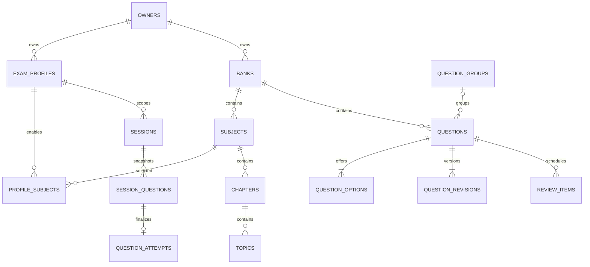

# قراردادهای داده و رابط‌های تستیونو
نسخه 1.0 — مرجع برای نوشتن TypeScript، Zod، SQL و JSON Schema؛ کدهای این سند نمونهٔ قراردادند و در این تحویل اجرا نمی‌شوند.

## 1. قواعد مشترک
ID در DB و قرارداد داخلی UUID string است. کلیدهای q1/o1 در JSON ورودی external key هستند و importer به UUID نگاشت می‌کند.
SQLite: UUID/Timestamp ISO/JSON با TEXT، epoch زمان داخلی با INTEGER، boolean با INTEGER CHECK IN(0,1).
PostgreSQL: UUID، timestamptz، jsonb، boolean. زمان‌های JSON ISO8601 با Z باشند.
مقادیر اعشاری نمرهٔ نهایی ذخیرهٔ منبع حقیقت نیستند؛ از عددهای شمارش و policy بازسازی شوند.
هویت نام درس با رجیستری مشترک resolve می‌شود: alias بازبینی‌شده به canonicalName تبدیل می‌شود و نام سفارشی فقط نرمال‌سازی نویسه/فاصله می‌گیرد؛ substring مبهم مجوز تغییر هویت نیست.
هر ستون در جدول‌های زیر nullable نیست مگر ? داشته باشد. PK=id مگر صریحاً کلید مرکب آمده باشد.
زمان t0 زمان ساخت command از ClockPort، نه default تصادفی چندباره در component.
ستون‌های مشترک M در جدول mutable: id UUID، created_at=t0، updated_at=t0، revision=1، inactive_at?=null.
ستون‌های مشترک I در جدول immutable: id UUID، created_at=t0. SQL UPDATE عمومی برای immutableها expose نشود.
FKها ON DELETE RESTRICT مگر metadata موقت import که پاکسازی کنترل‌شده دارد. بایگانی از inactive_at است.

## 2. فرهنگ مدل داده
### 2.1 مالک و پروفایل
| جدول | ستون‌ها علاوه بر M یا I | قید/index |
|---|---|---|
| owners (M) | kind:local/account؛ auth_user_id?:UUID؛ display_name:string؛ device_namespace:string | auth_user_id یکتا اگر غیرnull؛ device_namespace یکتا |
| exam_profiles (M) | owner_id:FK؛ name:string؛ target_track?:string؛ penalty_numerator:int=0؛ penalty_denominator:int=1؛ default_timer_mode:active/wall=active | denominator>0، numerator>=0؛ index(owner_id,inactive_at) |
| subjects (M) | bank_id:FK؛ name:string؛ normalized_name:string؛ language_kind:general/language=general؛ score_group?:string | UNIQUE(bank_id,normalized_name) |
| chapters (M) | subject_id:FK؛ name؛ normalized_name؛ position:int>=0 | UNIQUE(subject_id,normalized_name) |
| topics (M) | chapter_id:FK؛ name؛ normalized_name؛ position:int>=0؛ target_seconds?:int>0 | UNIQUE(chapter_id,normalized_name) |
| profile_subjects (M) | profile_id:FK؛ subject_id:FK؛ coefficient:decimal>=0؛ target_percentage:decimal 0..100؛ position:int>=0 | UNIQUE(profile_id,subject_id) |

SQLite owners.auth_user_id اعتبار امنیت ابری ندارد؛ سرور owners را به auth.users واقعی متصل می‌کند.
subject حذف نمی‌شود چون جلسهٔ تاریخی آن را مصرف کرده؛ عضویت با coefficient=0 یا inactive_at خاموش می‌شود.

### 2.2 بانک و سؤال
| جدول | ستون‌ها | قید/index |
|---|---|---|
| banks (M) | owner_id:FK؛ name؛ visibility:private/shared=private | shared عمومی نیست |
| bank_members (M) | bank_id؛ account_user_id؛ role:owner/editor/reader | UNIQUE(bank_id,account_user_id)؛ cloud only account |
| sources (M) | bank_id؛ kind:EXAM/AI/PERSONAL؛ title?:string؛ year?:int؛ external_key:string | UNIQUE(bank_id,external_key)؛ year صرفاً برچسب کاربر |
| question_groups (M) | bank_id؛ subject_id؛ chapter_id?؛ topic_id?؛ source_id?؛ source_namespace_key:string؛ external_key؛ kind:reading/cloze/shared؛ content_json:Block[]؛ expected_keys_json:string[]؛ status:complete/incomplete | UNIQUE(bank_id,source_namespace_key,external_key)؛ namespace برابر source ID یا literal local برای بدون منبع |
| questions (M) | bank_id؛ subject_id؛ chapter_id?؛ topic_id?؛ source_id?؛ source_namespace_key:string؛ source_number?:string؛ external_key:string؛ group_id?؛ group_position?:int؛ content_json:Block[]؛ explanation_json:Block[]=[]؛ correct_option_id?:UUID؛ status:draft/published؛ shuffle_safe:boolean=false؛ fingerprint:string؛ search_text:string؛ head_revision_id:UUID | index(bank_id,subject_id,status,inactive_at)؛ group_position همراه group_id؛ unique external key در source namespace |
| question_options (M) | question_id؛ position:int0..3؛ content_json:Block[] | UNIQUE(question_id,position)؛ همواره 4 ردیف برای published |
| question_revisions (I) | question_id؛ version:int؛ snapshot_json:QuestionSnapshot؛ content_hash:string؛ author_owner_id | UNIQUE(question_id,version) |
| media_files (M) | bank_id؛ sha256؛ mime:image/png,image/jpeg,image/webp؛ bytes:int>0؛ width:int>0؛ height:int>0؛ local_path?:string؛ remote_path?:string؛ availability:local/remote/both/missing؛ variant:original/optimized | UNIQUE(bank_id,sha256) |
| question_media (I) | question_id?؛ group_id?؛ media_id؛ role:content/reference/option؛ required:boolean | دقیقاً یکی از question_id/group_id؛ UNIQUE با owner relation/media/role |

correct_option_id باید در options همان question باشد؛ business validator و DB trigger/قید composite با transaction deferred کنترل کنند.
status=draft اجازهٔ correct_option_id=null دارد؛ render بانک و edit ممکن، آزمون ناممکن.
تغییر متن یا گزینه fingerprint جدید می‌سازد و revision را بالا می‌برد. identity سؤال ثابت می‌ماند.
source_number عدد محاسباتی نیست تا شماره‌هایی مثل 12-a حفظ شوند.

### 2.3 جلسه و رفتار
| جدول | ستون‌ها | قید/index |
|---|---|---|
| sessions (M) | owner_id؛ profile_id؛ state:CREATED/RUNNING/PAUSED/FINISHED؛ config_json:SessionConfig؛ policy_json:ScorePolicy؛ selection_seed:string؛ active_question_id?؛ active_group_id?؛ active_ms:int=0؛ wall_started_at?:epoch؛ deadline_at?:epoch؛ started_at?:epoch؛ finished_at?:epoch؛ finish_reason?:manual/expired؛ editor_device_id:string؛ lease_version:int=1 | index(owner_id,profile_id,state,updated_at)؛ question و group هم‌زمان active نیستند |
| session_groups (M) | session_id؛ group_id؛ snapshot_json؛ ordinal:int؛ reading_active_ms:int=0 | reading_active_ms تا پایان mutable است؛ UNIQUE(session_id,group_id) |
| session_questions (M) | session_id؛ question_id؛ question_revision_id؛ group_id?؛ ordinal:int؛ snapshot_json:QuestionSnapshot؛ option_order_json:UUID[4]؛ selected_option_id?:UUID؛ first_selected_option_id?:UUID؛ confidence?:sure/doubtful/guess؛ explicitly_skipped:boolean=false؛ visited:boolean=false؛ visit_count:int=0؛ change_count:int=0؛ active_ms:int=0؛ first_visited_at?:epoch؛ last_answer_at?:epoch؛ locked_at?:epoch | UNIQUE(session_id,question_id) و UNIQUE(session_id,ordinal) |
| question_attempts (I) | owner_id؛ profile_id؛ session_id؛ session_question_id؛ question_id؛ revision_id؛ selected_option_id?؛ result:correct/wrong/unanswered؛ was_visited:boolean؛ explicitly_skipped:boolean؛ confidence?؛ active_ms؛ change_count؛ first_selected_option_id?؛ finalized_at:epoch؛ exposed_answer:boolean؛ review_algorithm_version:int=1 | UNIQUE(session_question_id)؛ index(owner_id,profile_id,question_id,finalized_at) |
| attempt_events (I) | owner_id؛ session_question_id?؛ session_id؛ kind:visit/answer/clear/confidence/skip/reveal/pause/resume؛ payload_json محدود؛ occurred_at:epoch؛ device_id؛ device_sequence:int | UNIQUE(device_id,device_sequence)؛ heartbeat event عمومی ساخته نشود |

sessions.active_ms و interval counters باید از یک flush محاسبه شوند؛ counterهای نهایی پس از FINISHED تغییر نمی‌کنند.
هر session_question حتی ندیده در finish کامل یک attempt با was_visited=false دارد تا مخرج نمره مشخص بماند؛ review آن را کنار می‌گذارد.
question_attempts.created_at زمان درج و finalized_at زمان نهایی شدن است؛ تاریخچهٔ replay ترتیب finalizedAt,id دارد.
snapshot ساختاریافته شامل correctOptionId است ولی UI پیش از reveal آن را نشان نمی‌دهد؛ این ابزار آفلاین امنیت ضدتقلب ندارد.

### 2.4 مرور، پرامپت و عملیات
| جدول | ستون‌ها | قید/index |
|---|---|---|
| review_items (M) | owner_id؛ profile_id؛ question_id؛ due_at:epoch؛ priority:int0..3؛ stable_streak:int>=0؛ interval_days:int>=0؛ mastery:int0..100؛ last_attempt_id؛ last_attempt_at:epoch؛ algorithm_version:int=1 | UNIQUE(owner_id,profile_id,question_id)؛ index(owner_id,profile_id,due_at,priority) |
| prompts (M) | owner_id؛ subject_id?؛ kind:extract/generate/analyze؛ template_version:int؛ custom_instructions:string=""؛ locale:string=fa؛ schema_version:string=1.0 | UNIQUE(owner_id,subject_id,kind) با sentinel global |
| import_jobs (M) | owner_id؛ bank_id؛ input_sha256؛ schema_version؛ state:validating/running/completed/cancelled/failed؛ total_rows؛ committed_rows:int=0؛ duplicate_rows:int=0؛ failed_rows:int=0 | index(owner_id,created_at) |
| import_rows (M) | import_job_id؛ external_key؛ row_index؛ status:added/draft/duplicate/error؛ question_id?؛ raw_json؛ issues_json:ImportIssue[] | UNIQUE(import_job_id,row_index) |
| outbox (M) | owner_id؛ mutation_id؛ entity_type؛ entity_id؛ base_version:int؛ payload_json؛ state:pending/sending/blocked/acked؛ attempt_count:int=0؛ next_attempt_at:epoch؛ last_error_code? | UNIQUE(mutation_id)؛ index(owner_id,state,next_attempt_at) |
| applied_mutations (I) | owner_id؛ mutation_id؛ result_json | UNIQUE(owner_id,mutation_id) |
| sync_state (M) | owner_id؛ remote_cursor:string="0"؛ last_pull_at?؛ last_push_at?؛ last_error_code? | UNIQUE(owner_id) |
| schema_migrations | version:int PK؛ checksum:string؛ applied_at:epoch | ترتیب افزایشی، checksum immutable |

applied_mutations محلی command idempotency است؛ سرور جدول receipts هم‌معنی با actor authenticated دارد.
سرور اضافه بر جدول‌های بالا change_log با change_seq bigint identity، owner/bank visibility، entity، version، payload/tombstone دارد. pull بر change_seq صفحه‌بندی می‌شود.

## 3. ERD اصلی


## 4. TypeScript contracts
```ts
type ID = string;
type Direction = "rtl" | "ltr" | "auto";
type InlineCell = { type: "text"; value: string } | { type: "formula"; latex: string };
type Block =
  | { type: "text"; value: string; direction?: Direction; emphasis?: "normal" | "strong" | "underline" }
  | { type: "formula"; latex: string; display: boolean }
  | { type: "image"; mediaId: ID; alt: string }
  | { type: "table"; headers: InlineCell[]; rows: InlineCell[][]; caption?: string }
  | { type: "chart"; chartType: "bar" | "line"; labels: string[];
      series: { name: string; values: number[] }[]; caption?: string };
interface QuestionSnapshot {
  id: ID; revisionId: ID; subjectId: ID; chapterId: ID | null; topicId: ID | null;
  groupId: ID | null; content: Block[]; explanation: Block[];
  options: { id: ID; content: Block[] }[];
  correctOptionId: ID; shuffleSafe: boolean;
  source: { kind: "EXAM" | "AI" | "PERSONAL"; title?: string; year?: number; number?: string };
  media: { id: ID; sha256: string; role: "content" | "reference" | "option"; required: boolean }[];
}
interface ScorePolicy {
  penaltyNumerator: number; penaltyDenominator: number;
  policyVersion: 1;
}
interface SessionConfig {
  profileId: ID; subjectIds: ID[]; chapterIds: ID[]; topicIds: ID[];
  selectionMode: "random" | "new" | "wrong" | "due";
  requestedCount: number | null;
  timer: { mode: "active" | "wall"; durationSeconds: number | null };
  reveal: { mode: "end" } | { mode: "batch"; every: number };
  shuffleOptions: boolean;
}
interface ImportIssue {
  rowIndex: number; externalKey?: string; path: string;
  code: string; message: string;
}
interface ImportReport {
  jobId: ID; total: number; added: number; drafts: number;
  duplicates: number; failed: number; issues: ImportIssue[];
}
```

Validation: published options.length=4، IDs یکتا، correctOptionId شامل گزینه‌ها، table همهٔ rowها هم‌طول headers، chart هر series به تعداد labels و finite values، text trim غیرخالی، حداکثر 100 block در سؤال، متن هر block حداکثر 20,000 کاراکتر، latex حداکثر 10,000، table حداکثر 100×20، chart حداکثر 1,000 نقطه در هر series و 10 series.
حدها برای جلوگیری از ورودی نامحدود هستند؛ تغییرشان نیازمند تست fixture بزرگ است.

## 5. JSON ورودی استاندارد نسخهٔ 1.0
Schema خام generated در پیاده‌سازی از Zod ساخته می‌شود؛ این نمونه یک قرارداد کامل نمونه‌ای است.
نمونه آموزشی است؛ سؤال رسمی یا درس/ضریب تأییدشدهٔ کاربر نیست.

```json
{
  "schemaVersion": "1.0",
  "defaults": {
    "subject": "درس نمونه",
    "chapter": "فصل نمونه",
    "source": { "key": "personal-demo", "kind": "PERSONAL", "title": "نمونه آموزشی" }
  },
  "taxonomy": [
    { "subject": "درس نمونه", "chapters": [
      { "name": "فصل نمونه", "topics": ["موضوع نمونه"] }
    ]}
  ],
  "media": [],
  "groups": [],
  "questions": [
    {
      "key": "q1",
      "topic": "موضوع نمونه",
      "content": [{ "type": "text", "value": "حاصل ۲ + ۲ کدام است؟", "direction": "rtl" }],
      "options": [
        { "key": "a", "content": [{ "type": "text", "value": "۱" }] },
        { "key": "b", "content": [{ "type": "text", "value": "۲" }] },
        { "key": "c", "content": [{ "type": "text", "value": "۴" }] },
        { "key": "d", "content": [{ "type": "text", "value": "۵" }] }
      ],
      "correctOptionKey": "c",
      "explanation": [{ "type": "formula", "latex": "2+2=4", "display": true }],
      "shuffleSafe": true
    }
  ]
}
```

### Envelope
schemaVersion الزامی. defaults اختیاری اما subject باید در سؤال یا defaults resolve شود.
taxonomy/groups/media پیش‌فرض []؛ questions الزامی و nonempty.
question fields: key، content، options الزامی؛ subject/chapter/topic/source/sourceNumber/groupKey/groupPosition/referenceMediaKey/shuffleSafe/explanation/correctOptionKey اختیاری.
correctOptionKey غایب یا null → draft، نه error؛ options malformed → error.
unknown fieldها با issue رد شوند تا غلط املایی field بی‌صدا از بین نرود.
omitted hierarchy ارث می‌برد؛ null برای chapter/topic آن را صریح پاک می‌کند. subject=null ممنوع.
source override کل object را جایگزین می‌کند، deep merge ندارد.
در import بلوک image از mediaKey استفاده می‌کند؛ بعد از resolve داخلی mediaId می‌شود.
JSON ساده با mediaKey باید قبلاً رسانه را در staging همین import دریافت کرده باشد؛ unresolved reference → خطای سؤال وابسته.

### گروه
```json
{
  "key": "reading-1",
  "kind": "reading",
  "subject": "زبان نمونه",
  "chapter": "Reading",
  "content": [{ "type": "text", "value": "This is a sample passage.", "direction": "ltr" }],
  "questionKeys": ["q2", "q3"]
}
```
عضو به groupKey=reading-1 و groupPosition=0/1 اشاره می‌کند؛ taxonomy اعضا باید با گروه سازگار باشد.
گروه باید در همان envelope یا source namespace موجود باشد. ترتیب questionKeys مرجع نهایی است؛ groupPosition ناسازگار خطاست.
گروه complete تنها با همهٔ اعضای معتبر چهارگزینه‌ای و پاسخ‌دار است.
reading یک سؤال ناقص داشته باشد: عضو سالم added ولی گروه incomplete. گزارش هم خطای عضو و هم هشدار گروه را نشان دهد.

### خطاها
INVALID_JSON، UNSUPPORTED_SCHEMA، UNKNOWN_FIELD، MISSING_SUBJECT، INVALID_PARENT، INVALID_OPTIONS، INVALID_ANSWER، DUPLICATE_KEY، MISSING_GROUP، INCOMPLETE_GROUP، MISSING_MEDIA، LIMIT_EXCEEDED، STORAGE_WRITE_FAILED.
کل JSON syntax نامعتبر ردیف‌بندی قابل اتکا ندارد: هیچ write و خطای envelope. «97 سالم» فقط بعد از parse معتبر معنا دارد.

## 6. Interface سرویس‌ها
تمام writeها CommandContext شامل ownerId، operationId، expectedRevision? و clock دارند.
Result<T> = {ok:true,value:T} | {ok:false,error:{code,message,fieldIssues?,retryable}}.
Promise reject فقط exception غیرمنتظره؛ UI error boundary آن را می‌گیرد. خطاهای محصول typed برگردند.

| سرویس | ورودی | خروجی/اثر قطعی |
|---|---|---|
| ProfileService.save | profile draft، subjects و context | ID و revision؛ transaction مشترک |
| QuestionRepository.search | owner/bank scope، filters، cursor، limit<=50 | items، nextCursor، total |
| QuestionService.save | draft یا published input، expectedRevision | question + revision؛ snapshot قدیمی تغییر نکند |
| ImportService.validate | bytes/text و bankId | envelope یا issue کلی، بدون write |
| ImportService.commit | validated input، jobId، AbortSignal | گزارش، پیشرفت async |
| MediaService.ingest | File و role | metadata+local hash بعد از save |
| SessionService.preview | SessionConfig | actualCount، units و warnings |
| SessionService.create | config + accepted preview token | CREATED session |
| SessionService.command | sessionId + command union | snapshot جدید durable |
| ReviewService.listDue | owner/profile، now، cursor | queue items + دلیل |
| AnalyticsService.subjectSummary | profile، period، policy، mode | counts، percentage|null، sample size |
| PromptService.render | kind، subject، input | متن + schemaVersion + estimatedCharacters |
| BackupService.export | owner scope | stream manifest/data/media و completeness |
| BackupService.restore | archive، restoreMode=replace-owner | staged validation سپس atomic switch |
| SyncService.run | owner + AbortSignal | pushed/pulled/pending/conflicts |

preview token شامل fingerprint eligible IDs/revisions است؛ create اگر بانک تغییر کرده دوباره preview درخواست می‌کند تا actualCount بی‌خبر تغییر نکند.
SessionCommand union: start، answer، clear، confidence، skip، navigate، readGroup، pause، resume، appendNextUnit، revealBatch، finish.
همه sessionId و operationId دارند؛ answer گزینه ID، navigate sessionQuestionId، finish confirmation summary hash.
readGroup فقط group متعلق به snapshot؛ active question interval را می‌بندد.

## 7. JSON خروجی تحلیل
```json
{
  "schemaVersion": "1.0",
  "exportType": "session-analysis",
  "generatedAt": "2026-09-09T10:00:00.000Z",
  "scope": "mistakes",
  "session": {
    "alias": "session-1",
    "state": "FINISHED",
    "mode": "end-reveal",
    "policy": { "penaltyNumerator": 0, "penaltyDenominator": 1, "policyVersion": 1 },
    "summary": { "correct": 0, "wrong": 1, "unanswered": 0, "unvisited": 0, "total": 1, "percentage": 0 }
  },
  "attempts": [
    {
      "questionAlias": "q1",
      "subject": "درس نمونه",
      "result": "wrong",
      "selectedOptionKey": "a",
      "correctOptionKey": "c",
      "activeMs": 24000,
      "confidence": null,
      "changeCount": 0,
      "wasVisited": true
    }
  ],
  "questions": [
    {
      "alias": "q1",
      "subject": "درس نمونه",
      "groupAlias": null,
      "content": [{ "type": "text", "value": "حاصل ۲ + ۲ کدام است؟", "direction": "rtl" }],
      "options": [
        { "key": "a", "content": [{ "type": "text", "value": "۱" }] },
        { "key": "b", "content": [{ "type": "text", "value": "۲" }] },
        { "key": "c", "content": [{ "type": "text", "value": "۴" }] },
        { "key": "d", "content": [{ "type": "text", "value": "۵" }] }
      ],
      "correctOptionKey": "c",
      "explanation": [{ "type": "formula", "latex": "2+2=4", "display": true }]
    }
  ],
  "groups": [],
  "reviewAlgorithmVersion": 1
}
```
questions برای هر attempt انتخاب‌شده snapshot مرتبط را دارد؛ aliasها باید resolve شوند. groups context مشترک گروه‌های مرتبط را با alias نگه می‌دارد. validator خروجی، attempt بدون snapshot و groupAlias بدون context را رد می‌کند. نمونهٔ بالا یک بستهٔ کامل آموزشی با یک تلاش است.
scope=mistakes شامل wrong، unanswered دیده‌شده، correct doubtful/guess؛ summary همچنان کل جلسه است و scope صریحاً جلوی اشتباه در مخرج را می‌گیرد.
owner ID، email، access token، device ID و source local path صادر نشوند. aliasها صرفاً داخل همان export قابل تطبیق‌اند.
تاریخچهٔ سؤال opt-in و حداکثر 20 تلاش آخر با ترتیب زمانی. تصویر فقط انتخاب صریح کاربر و export bundle.

## 8. Backup envelope
manifest.json: schemaVersion، appVersion، exportedAt، ownerAlias، counts، entries:[{path,sha256,bytes,mime}].
data.json: owners بدون auth credential، profile، bank content، question revisions، sessions، attempts، review، prompts.
media/<sha256>.<ext>: فقط blobهای referenced. outbox و refresh token منتقل نشوند؛ پس از restore اگر sync فعال شود reconciliation job مستقل بسازد.
restore به حساب دیگر default ممنوع؛ local backup می‌تواند در owner محلی جدید import شود و onboarding اتصال حساب جدا انجام شود.

## 9. invariants تست‌شونده
- هیچ option ID متعلق به سؤال دیگر پذیرفته نشود.
- هر selectedOptionId در option_order وجود داشته باشد.
- correct+wrong+unanswered=total و unvisited<=unanswered.
- activeMs>=0 و زمان گروه دوباره در سؤال شمرده نشود.
- FINISHED attempt دوباره ایجاد نشود.
- replay همان operationId خروجی یکسان بدهد.
- restore hashها و FKها را حفظ کند.
- دو مالک یک query cache key یا DB namespace نداشته باشند.


## 10. جزئیات تکمیلی wire و محدودیت فرمان‌ها
### MediaEntry ورودی
هر عضو envelope.media دقیقاً این فیلدها را دارد: key:string، path:string نسبی زیر media/، mime از allowlist، bytes:int>0، sha256:hex64، width:int>0، height:int>0.
فایل JSON تنها: این path نام logical فایل انتخاب‌شدهٔ کاربر در staging همان job است، نه اجازهٔ خواندن مسیر local دلخواه.
ZIP: path باید با entry واقعی برابر باشد؛ byte/hash و ابعاد اعلام‌شده دوباره از فایل کنترل شوند. manifest جعلی معتبر نیست.
question.referenceMediaKey اختیاری فقط viewer مرجع می‌سازد؛ image block.mediaKey رسانهٔ ضروری محتواست.
question/options/explanation blockهای ورودی همان Block هستند به استثنای image.mediaKey به جای mediaId؛ خروجی تحلیل mediaAlias دارد و بستهٔ انتخاب‌شده alias→hash را نگه می‌دارد.
referenceMediaKey در options مجاز نیست؛ عکس گزینه با image block در content خود گزینه قرار می‌گیرد.

### بازه‌ها
- name درس/فصل/موضوع/پروفایل: پس از trim بین1و200 کاراکتر؛ source title حداکثر300.
- external key:1تا128کاراکتر؛ ممنوعیت null byte؛ namespace داخلی UUID/source یا local است.
- coefficient:0تا100، حداکثر3رقم اعشار؛ این سقف فنی است نه ضریب رسمی.
- scoreGroup پس از trim یا null است؛ اعضای هم‌نام در یک پروفایل باید coefficient یکسان داشته باشند. درصد/هدف اعضا ابتدا با وزن questionCount تجمیع و coefficient گروه فقط یک‌بار در میانگین کل اعمال می‌شود.
- requestedCount:عدد صحیح1تا10000 یا null؛ overshoot گروه تا اندازهٔ eligible pool مجاز و پیش‌نمایش اجباری.
- durationSeconds:عدد صحیح60تا86400 یا null؛ null یعنی زمان آزاد و wall mode در این حالت غیرفعال.
- reveal.every:عدد صحیح1تا10000؛ پیش‌فرض UI برای batch برابر1 ولی فقط پس از انتخاب آن حالت.
- group.questionKeys:1تا100عضو یکتا؛ گزینه‌های published دقیقاً4.
- current profile targetPercentage الزامی؛ فرم بدون هدف ذخیره نمی‌شود. هیچ target جعلی به صورت خودکار تزریق نشود.
- session state command guard، مالک و revision حتی برای ورودی ساخته‌شده توسط خود UI دوباره validate شوند.

### sync payload محدود
entityType enum از profile،profileSubject،subject،chapter،topic،source،questionRevision،questionHead،questionGroup،session،sessionQuestion،attempt،attemptEvent،prompt،mediaManifest،tombstone انتخاب شود.
هر entity schema مستقل دارد؛ payload دلخواه jsonb به معنی پذیرش هر فیلد نیست.
push result برای هر mutation: mutationId،status=accepted/duplicate/conflict/rejected،serverVersion?،changeSeq?،errorCode?.
pull change: changeSeq به صورت decimal string برای جلوگیری از overflow JS،entityType،entityId،serverVersion،payload یا tombstone=true.
server state مقصد review را از attemptها می‌سازد؛ client ارسال review item مشتق را به عنوان منبع حقیقت قبول نکند.
روابط parent/child در یک mutation aggregate مثل question revision+options نوشته می‌شوند تا batch split FK ناقص نسازد.
