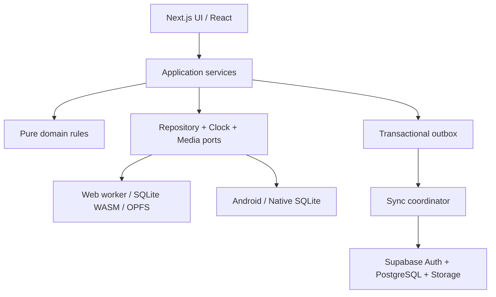

# TESTINO — معماری و نقشهٔ فنی پیاده‌سازی
نسخه 1.0 | وابسته به TESTINO_PRODUCT_BLUEPRINT.md
وضعیت: سند طراحی؛ این فایل ادعای وجود کد، migration اجراشده یا تست موفق ندارد.

## 1. تصمیم معماری
یک اپ Next.js با خروجی static؛ هستهٔ TypeScript مستقل؛ Repository محلی؛ SQLite واقعی روی دو adapter؛ Sync به عنوان پردازش پس‌زمینهٔ اختیاری.
هیچ عملیات ضروری آزمون به route handler یا Server Action وابسته نشود. خروجی static در وب سرو و در Capacitor بسته‌بندی می‌شود.

### مرزها
- domain: type، invariant، selection، scoring، state machine، review؛ بدون React/SQL/Date.now مستقیم.
- application: orchestrator هر use case؛ transaction، clock و repository تزریق می‌شوند.
- infrastructure: SQLite، Worker RPC، رسانه، فایل، Supabase، lifecycle.
- presentation: نمایش و فرم؛ هیچ محاسبهٔ نمره یا SQL در component نیست.
- یک repository در کل فرایند UI؛ باز کردن اتصال برای هر component ممنوع.
- UI فقط پس از durable commit cache را invalidate می‌کند؛ نشان دادن optimistic «ذخیره شد» ممنوع.

## 2. فناوری‌ها و قاعدهٔ نسخه
| مسئولیت | انتخاب |
|---|---|
| اپ | Next.js 16.x، React 19.x، TypeScript strict |
| ظاهر | Tailwind CSS 4، shadcn/ui با componentهای محلی و Radix زیرساخت |
| فرم | React Hook Form + resolver سازگار Zod 4 |
| validation | Zod؛ JSON Schema خروجی از همین schemaها |
| دادهٔ UI | TanStack Query 5 برای query/invalidation؛ DB منبع حقیقت |
| state گذرا | Zustand 5 فقط selection UI، dialog، preference؛ پاسخ آزمون در store منبع اصلی نیست |
| فرمول | KaTeX با trust=false؛ محتوای خطادار fallback متنی مشخص |
| نمودار | Recharts؛ lazy فقط صفحات تحلیل |
| دیتابیس وب | بستهٔ رسمی @sqlite.org/sqlite-wasm، Worker، OPFS SAH-pool |
| دیتابیس Android | @capacitor-community/sqlite، نسخهٔ سازگار با major Capacitor |
| بسته موبایل | Capacitor 8.x و Android plugin هم‌نسخه |
| ابر | Supabase JS 2، Auth، PostgreSQL، Storage، SQL RPC |
| تست | Vitest، Testing Library، Playwright؛ آخرین نسخهٔ سازگار هنگام setup |
| پشتیبان ZIP | fflate با پردازش worker و محدودیت حجم بازشده |
| فونت | Vazirmatn و Inter از فایل محلی با مجوز همراه |

نسخهٔ exact و lockfile در TASK-001 پس از بررسی peer dependency و امنیت قفل شود. عدد patch حدسی در این سند دستور نصب نیست. کتابخانهٔ مشابه برای کار واحد نصب نشود. ORM در نسخهٔ یک لازم نیست؛ SQL پارامتری و mapper typed کافی است.

### منابع رسمی تصمیم
- [Next.js static export](https://nextjs.org/docs/app/guides/static-exports): محدودیت قابلیت‌های نیازمند سرور؛ مسیرهای محلی runtime با query string.
- [SQLite persistent storage](https://www.sqlite.org/wasm/doc/trunk/persistence.md): ذخیرهٔ مرورگری وابسته به API و پشتیبانی مرورگر است؛ probe واقعی لازم است.
- [Capacitor workflow](https://capacitorjs.com/docs/basics/workflow): assetهای web build از webDir به پروژهٔ native sync می‌شوند.
این منابع انتخاب ساختار را پشتیبانی می‌کنند؛ سازگاری عملی adapterها باید در spike ذخیره‌سازی اثبات شود.

## 3. مسیرها و پوستهٔ برنامه
مسیرهای ثابت: /، /onboarding/، /bank/، /bank/question/، /import/، /sessions/، /sessions/new/، /sessions/run/، /sessions/result/، /review/، /analytics/، /ai/، /settings/.
شناسهٔ runtime با query: /sessions/run/?id=<uuid>. route پویا با تعداد نامعلوم و generateStaticParams برای تمام بانک ساخته نشود.
هر page یک wrapper سبک است؛ component اصلی در features قرار دارد. useSearchParams زیر Suspense؛ دسترسی window/DB فقط در client boundary.
metadata عمومی فارسی؛ اطلاعات شخصی در build یا فایل static نباشد.
پورت توسعهٔ پیشنهادی 3100 برای عدم تداخل با پروژه‌های دیگر؛ اجرا فقط داخل مسیر مستقل Testino.

## 4. ذخیره‌سازی محلی
### 4.1 Port اصلی
DatabasePort: open(ownerKey), transaction(callback), query(sql,params), execute(sql,params), close(), health(), exportSnapshot().
Repositoryها query typed برمی‌گردانند و SQL را پنهان می‌کنند. پارامترها bind شوند؛ نام جدول/ستون از enum ثابت، نه ورودی کاربر.

### 4.2 وب
- main thread فقط RPC typed به dedicated worker می‌فرستد.
- Worker SQLite WASM را از asset محلی bundle بارگذاری می‌کند؛ CDN زمان اجرا وجود ندارد.
- دیتابیس روی OPFS در namespace مالک است؛ SAH pool نیاز به probe و تست مرورگر هدف دارد.
- Web Locks با نام testino-db:<owner> برای کل طول عمر اتصال گرفته شود.
- تب دوم پیام «این بانک در تب دیگری باز است» می‌بیند؛ تا انتقال مالکیت lock امکان نوشتن ندارد.
- عدم پشتیبانی OPFS/Worker/Web Locks: حالت unsupported واضح؛ fallback خاموشِ in-memory یا localStorage ممنوع.
- درخواست persist مرورگر در تنظیمات به عنوان best effort؛ رد آن خطا برای حل آزمون نیست، اما وضعیت دوام داده نمایش داده شود.
- هیچ DB blob کامل در هر heartbeat export نشود؛ writeهای کوچک transactional.
- کلید owner محلی random نصب است، نه شناسهٔ قابل اعتماد برای امنیت ابری.

### 4.3 Android
همان SQL migration و repository، پشت adapter native. از bridge رسمی plugin برای query و transaction استفاده شود؛ SQL string در React پراکنده نشود.
App lifecycle باید active interval را ببندد؛ kill اجباری با heartbeat بازیابی می‌شود.
داده و media در sandbox اپ؛ فایل خروجی با SAF/share sheet؛ مجوز عمومی دسترسی همهٔ فایل‌ها درخواست نشود.
native adapter باید قبل از افزودن قابلیت موبایل با قرارداد transaction/rollback و حفظ FK وب مقایسه شود.

### 4.4 تراکنش و migration
PRAGMA foreign_keys=ON در هر connection. journal mode مناسب adapter، نه WAL اجباری برای هر WASM backend.
migrationها شمارهٔ افزایشی، checksum و یک transaction دارند. schema_migrations ثبت می‌کند کدام اجرا شده.
قبل از migration مخرب backup؛ نسخهٔ آیندهٔ ناشناخته read-only + پیام نیاز به آپدیت.
هر domain mutation، entity و outbox و revision را در یک transaction ثبت می‌کند. DB commit موفق و enqueue ناموفق نباید قابل وقوع باشد.
rollback تضمین‌شده؛ timeout RPC بعد از commit «نتیجه نامشخص» است، نه شکست قطعی. retry با همان operationId پاسخ قبلی را برمی‌گرداند.

## 5. مدل داده و مالکیت
فرهنگ تمام ستون‌ها در docs/DATA_CONTRACTS.md مرجع اجرایی است.

### موجودیت‌های اصلی
- owners، exam_profiles، profile_subjects، subjects، chapters، topics.
- banks، bank_members، sources، question_groups، questions، question_options، question_revisions.
- media_files و question_media برای نسبت تصویر به سؤال/گروه.
- sessions، session_questions، session_groups، question_attempts، attempt_events.
- review_items، prompts، import_jobs، import_rows.
- outbox، applied_mutations، sync_state، schema_migrations.

### قیود
- UUID v4 سمت client برای identity؛ هیچ عدد ترتیبی وابسته به سرور.
- زمان UTC ISO در JSON، integer epoch ms در SQLite، timestamptz در PostgreSQL.
- همهٔ تغییرپذیرها revision عدد مثبت دارند؛ inactive_at nullable برای بایگانی.
- user_id بر رفتار؛ bank_id بر سؤال. RLS از مالک authenticated استفاده کند، نه ownerId ارسالی.
- question_options: UNIQUE(question_id,id)، UNIQUE(question_id,position).
- کلید صحیح باید عضو همان سؤال باشد. ایجاد سؤال/options/key در یک transaction؛ deferred FK یا validation transaction برای حلقهٔ reference.
- question/chapter/topic هر سه به یک subject و bank تعلق داشته باشند؛ فقط FKهای ساده برای جلوگیری از mismatch کافی نیستند.
- session_questions UNIQUE(session_id,question_id) و UNIQUE(session_id,ordinal).
- attempt یک بار برای هر session_question نهایی می‌شود. تکرار finalize با conflict-safe insert idempotent است.
- فهرست فعال بودن profile_subjects از فعال بودن بانک/سؤال مستقل است.

### Snapshot
ساخت جلسه snapshot صورت، گزینه‌ها، کلید، پاسخ تشریحی، منبع، نسخهٔ گروه، media hashes و scoring policy را نگه می‌دارد.
session_questions پاسخ جاری و option_order را نگه می‌دارد. attempt نهایی immutable است.
question_revisions برای هر ویرایش immutable؛ session به نسخه اشاره می‌کند و snapshot خودکفا نیز دارد تا backup مستقل کار کند.
اصلاح پاسخنامهٔ بانک، تلاش قدیمی را خودکار rescore نمی‌کند؛ feature محاسبهٔ مجدد تاریخی خارج نسخهٔ یک است.

## 6. Rich content
Discriminated union: text، formula، image، table، chart. recursion آزاد/HTML خام نداریم.
text شامل value و direction و emphasis اختیاری است. formula فقط latex و display.
table آرایهٔ مستطیلی cellهای text/formula ساده؛ chart مشخصات محدود bar/line با label و series عددی، نه اجرای کد.
image فقط mediaId و alt و role، نه URL خارجی قابل fetch.
KaTeX trust=false و maxExpand محدود؛ خطا کارت «فرمول نیاز به اصلاح دارد» + LaTeX خام escaped.
متن به صورت React text node؛ dangerouslySetInnerHTML تنها برای خروجی KaTeX با تنظیمات محدود و تابع محصور renderer.
جست‌وجو نسخهٔ normalized plain text از بلوک‌هاست؛ اصل متن تغییر نکند. ي→ی، ك→ک، whitespace یکسان؛ اعراب برای index حذف ولی محتوای اصلی حفظ شود.

## 7. Import pipeline
1. بررسی حداکثر فایل 20 MiB و حداکثر 10,000 سؤال در job؛ خواندن/parse در worker.
2. validate envelope و schemaVersion؛ version ناشناخته بدون write رد شود.
3. normalize defaults و نام درس با subject-registry مشترک، local keys و hierarchy؛ فصل/موضوع جدید فقط زیر والد معلوم و از بخش taxonomy معتبر بسته ساخته شود.
4. resolve media از manifest؛ هیچ download خودکار URL اجرا نشود.
5. validate مستقل هر سؤال/گروه؛ جمع‌آوری issueهای field-level.
6. ساخت fingerprint SHA-256 روی محتوای canonical، گزینه‌ها، کلید به متن canonical، subject و group context. گزینه‌ها فقط برای shuffleSafe=true بر اساس متن canonical مرتب شوند؛ برای false ترتیب اصلی جزو hash است. media ID به hash محتوا resolve شود؛ ID تصادفی و زمان/source metadata وارد hash نشوند. canonical JSON با کلیدهای مرتب، نرمال‌سازی محدود فارسی و حفظ دقیق LaTeX/اعداد تولید شود.
7. exact match همان bank → duplicate؛ hash با پاسخ متفاوت duplicate نیست و warning نیاز به بررسی دارد.
8. transaction کوتاه برای هر سؤال مستقل؛ برای group یک transaction متادیتا و اعضای سالم با status incomplete.
9. نوشتن import_rows و outbox همان transaction. پس از هر 100 واحد event پیشرفت؛ yield برای لغو.
10. خروجی report؛ retry فقط ردیف‌های شکست‌خورده با import key ثابت.

CANCEL: ردیف‌های قبلی rollback کلی نشوند؛ وضعیت job cancelled و تعداد قطعی باقی بماند.
تراکنش عمومی 10هزار سؤالی نسازید. لغو در مرز transaction انجام شود.
دقت fingerprint با collision مستقل content compare تأیید شود؛ hash فقط index است.

### گروه ناقص
گروه expectedQuestionKeys را دارد؛ تا تمام اعضای اعلام‌شده معتبر و فعال نیستند group.status=incomplete.
اعضای سالم وارد بانک می‌شوند و قابل اصلاح‌اند ولی selector گروه را حذف می‌کند.
retry در همان group key عضو معیوب را اضافه می‌کند، سپس completeness دوباره محاسبه می‌شود.
group key از namespace بانک+source+externalGroupKey است؛ keyهای یکسان منابع متفاوت تصادم ندارند.

## 8. انتخاب سؤال
ورودی: profileId، filter، selectionMode، requestedCount|null، rngSeed.
خروجی: واحدهای ordered question/group، actualCount، warnings و frozenSeed.
- query تنها published/active و media-ready و profile-eligible.
- دستهٔ weak: آخرین attempt غلط؛ new: بدون attempt در همین profile؛ due: dueAt <= now.
- سؤال مشترک گروه فقط همراه کل گروه؛ برای weak/due اگر یکی از اعضا match باشد گروه eligible است.
- واحدها با seeded Fisher–Yates مرتب شوند؛ PRNG pure با الگوریتم/version ثابت و test vector.
- برای تعداد n، واحدها تا اولین رسیدن/عبور از n انتخاب شوند؛ overshoot فقط برای کامل بودن آخرین گروه.
- actualCount پیش از create/start به کاربر نشان داده شود؛ الگوریتم در پشت صحنه عدد را تغییر ندهد.
- option shuffle فقط shuffleSafe=true و متن گزینه‌های مستقل؛ ترتیب و snapshot در DB، نه shuffle دوباره در render.
- open-ended هر بار واحد بعدی از pool تازه انتخاب می‌کند و قبلی‌ها را exclude؛ append، ordinal، outbox یک transaction.

## 9. Session service
createSession: validate config → select units → snapshot policy/questions/groups → state CREATED.
startSession: transaction pause قبلی → RUNNING، activeQuestion، timer anchors → persist.
answerQuestion: verify RUNNING، question unlocked، option belongs → update draft + event semantic + operationId.
navigate: flush active segment → visit target → checkpoint؛ در خطای save همان سؤال بماند.
pause: flush → PAUSED → release active lease؛ idempotent.
resume: verify owner/device lease → reconstruct paused elapsed → RUNNING.
revealBatch: confirm UI → finalize batch once → lock attempts → reveal snapshot answers.
finish: close segments → finalize remaining exactly once → session FINISHED → review update/outbox در همان transaction.
اگر wall-clock deadline گذشته است، پیش از پذیرش answer یا resume finalize با finishReason=expired انجام شود.

### مقادیر پاسخ
selectedOptionId nullable؛ confidence nullable/sure/doubtful/guess؛ explicitlySkipped boolean؛ firstSelectedOptionId nullable؛ changeCount>=0.
Clearing یک انتخاب changeCount را افزایش می‌دهد و selected=null؛ کلیک دوباره روی همان ID اثر ندارد.
firstSelected هرگز با تغییر پاسخ overwrite نشود.
answer event فقط انتخاب/پاک کردن/confidence/skip/navigation/reveal را ثبت کند؛ mousemove/keypress خام ذخیره نشود.

## 10. Active time و بازیابی
ClockPort: monotonicNow() و utcNow()؛ fake clock برای تست.
هر interval یک owner دارد: question یا group. زمان متن مشترک وقتی shared-panel مطالعه می‌شود و سؤال active نیست ثبت می‌شود؛ UI کنترل صریح «مطالعه متن»/«حل سؤال» دارد تا حدس focus غلط نشود.
session.activeMs = مجموع همهٔ intervalهای question و group؛ interval هم‌زمان ممنوع.
heartbeat هر 2s: delta<=5s و visibility/focus فعال → delta اضافه و checkpoint؛ فاصلهٔ بزرگ → pause بدون ثبت gap.
on blur/visibility hidden/app background/pagehide: close interval و درخواست flush. pagehide تضمین تکمیل ندارد؛ heartbeat پشتیبان است.
reload وضعیت persisted RUNNING را PAUSED می‌کند؛ delta از UTC گذشته به activeMs اضافه نمی‌کند.
wall-clock duration با deadlineAt UTC مستقل است؛ تغییر ساعت سیستم ریسک حالت آفلاین است، anti-cheat ادعا نشود.
پیش از ذخیرهٔ پاسخ active elapsed نهایی flush شود تا زمان جواب و متن در sync یک نسخه داشته باشند.

### جلوگیری از race
Application command queue تک‌نویسنده در هر owner. operationId UUID به تمام writeها.
دکمهٔ navigation و finish حین write غیرفعال؛ save failed نمایش retry و export اضطراری در صورت امکان.
هر command expectedRevision دارد؛ اختلاف نسخه ConflictError، cache refresh و اعمال مجدد انتخاب آگاهانه.
Worker RPC با requestId و reply success/error؛ timeout 15s با وضعیت نامشخص، نه اجرای operationId تازه.

## 11. نمره و review
### Score
calculateScore(attempts, policy) نتیجه {correct,wrong,unanswered,unvisited,total,netPoints,percentage}.
unvisited زیرمجموعهٔ unanswered است؛ جمع correct+wrong+unanswered=total.
penaltyNumerator/penaltyDenominator اعداد صحیح غیرمنفی/مثبت؛ rounding فقط نمایش یک رقم اعشار.
null برای total=0. قانون snapshot هر جلسه برای dashboard grouping استفاده شود.

### Review algorithm v1
ورودی: attempt نهایی‌شده، وضعیت قبلی، زمان UTC.
- wrong یا unanswered دیده‌شده: priority 0 یا 1، streak=0، dueAt=now؛ تا خروج از session دوباره داخل همان جلسه انتخاب نشود.
- correct با doubtful/guess: priority 2، streak=0، dueAt=now+1 day.
- correct با confidence=null: priority 3، streak بدون افزایش، dueAt=now+min(3, previousIntervalDays یا 1) day.
- correct با sure: streak قبلی+1؛ فواصل [1,3,7,14,30] با cap30؛ priority3.
- unvisited بدون skip: هیچ review item ساخته/تغییر نمی‌شود.
- مرتبه sort: priority asc، dueAt asc، lastAttemptAt asc، questionId برای ثبات.
- dueAt interval دقیق UTC است؛ تاریخ نمایشی محلی، روز DST در محاسبه دوباره اضافه نشود.
- یک attempt از دستگاه‌های مختلف فقط یک بار اعمال شود؛ rebuild از attemptهای immutable قابل انجام است.

### Mastery نمایشی
آخرین حداکثر 5 تلاش نهایی همان سؤال/پروفایل با ترتیب finalizedAt، id.
وزن‌ها از قدیم به جدید 1..n.
کیفیت: غلط/سفید=0؛ درست حدسی=.4؛ درست شک‌دار=.6؛ درست بدون confidence=.75؛ درست مطمئن=1.
score=round(100*sum(weight*quality)/sum(weight)).
زمان به عنوان شاخص جدا نمایش داده شود؛ تا کاربر targetSeconds موضوع را تعریف نکرده، زمان زیاد جریمهٔ تسلط نیست.
با targetSeconds، speedRatio گزارش شود؛ v1 mastery را تغییر نمی‌دهد تا به سؤال طولانی جریمهٔ بی‌دلیل ندهد.
این فرمول heuristic است؛ algorithmVersion در review و export لازم است.

## 12. Query و cache
Query key شامل ownerKey، profileId، resource، filters و page باشد.
پس از commit question، bank/search/selection invalidated؛ پس از finalize، sessions/review/analytics invalidated.
UI list pagination با cursor(createdAt,id)؛ counts query جدا؛ index برای owner/profile/time و bank/subject/status.
cache فقط سرعت است؛ پاک شدن آن نباید پاسخ را پاک کند. Zustand persistence تنها theme و آخرین صفحه، بدون session drafts.
حساب عوض شد: cancel query، close DB، clear QueryClient و store گذرا، open namespace جدید.
analytics با SQL aggregate یا pure reduce دادهٔ bounded؛ 10هزار سؤال را برای یک کارت download نکند.

## 13. Sync ابری
این بخش بعد از سلامت آفلاین پیاده شود؛ قبل از آن UI وضعیت «همگام‌سازی هنوز تنظیم نشده» نشان می‌دهد.

### مدل پروتکل
push RPC: push_mutations({deviceId,mutations:[{mutationId,entityType,entityId,baseVersion,payload}]}).
pull RPC: pull_changes({cursor,limit}) → {changes,nextCursor,hasMore}.
سرور user_id را از auth.uid() تعیین و ACL bank را بررسی می‌کند.
mutationId UNIQUE(actor_id,mutation_id)، نتیجهٔ پذیرفته‌شده برای retry نگه داشته شود.
سرور برای ترتیب pull یک change_seq ترتیبی در transaction می‌نویسد؛ pagination به timestamp تنها تکیه نکند.
client ack فقط بعد از transaction اعمال pull + cursor. push موفق و قطع شبکه قبل از ack با همان mutationId تکرار می‌شود.

### تعارض
- attempts/events immutable: append و dedupe، هرگز LWW روی کل تاریخچه.
- question edit immutable revision ایجاد می‌کند؛ سرور head را با ترتیب پذیرش تعیین می‌کند، نسخهٔ بازنده محفوظ و conflict نشان داده می‌شود.
- تنظیمات/profiles: last accepted server write wins در سطح رکورد؛ ساعت دیوایس معیار برنده نیست.
- session unfinished: یک device مالک edit lease است. انتقال فقط آنلاین و explicit takeover؛ کل snapshot یک session با LWW merge نمی‌شود.
- دستگاه قدیمی آفلاین پس از takeover که پاسخ جدید دارد: سرور conflict می‌دهد؛ client نسخهٔ محلی را به recovery session با ID جدید fork می‌کند و انتخاب discard فقط با تأیید کاربر.
- FINISHED terminal است؛ remote draft نمی‌تواند آن را running کند.
- review از attempts بازسازی‌پذیر است؛ server merge مستقیم intervalهای دو دستگاه ممنوع.
- tombstone با version در pull منتقل می‌شود؛ delete فیزیکی قبل از ack دستگاه‌های فعال انجام نشود.

### Retry و media
batch حداکثر 100 mutation یا 1 MiB؛ backoff 1s،2s،4s… تا60s با jitter.
خطای شبکه retry؛ 401 refresh یک بار، سپس paused-auth؛ 403 blocked با دلیل؛ schema error quarantine و بقیهٔ مستقل ادامه.
media: upload staging hash → verify → finalize object → push reference. reference بدون blob آماده به عنوان pending_media، برای آزمون لازم قابل انتخاب نباشد.
pull metadata و media download وضعیت جدا؛ موفقیت sync متن به معنی دانلود همهٔ تصاویر نیست.
sync هنگام شروع، online، بازگشت foreground و 30s در foreground؛ هیچ وابستگی آزمون به موفقیت sync.

## 14. امنیت
Supabase RLS بر همهٔ جدول‌های قابل دسترسی روشن؛ migrations بدون RLS gate انتشار را رد کنند.
owner-only: profiles، sessions، attempts، review، prompt شخصی، outbox server receipts.
bank-readable: محتوای سؤال برای member؛ insert/update فقط editor/owner؛ مدیریت اعضا فقط owner.
Storage path دارای bankId/hash و policy بر membership؛ public bucket برای محتوای شخصی ممنوع.
service-role secret هیچ‌وقت در browser/mobile؛ publishable key مجوز RLS را دور نمی‌زند.
Google OAuth با PKCE، redirect allowlist و deep link محدود؛ مقصد redirect از ورودی آزاد پذیرفته نشود.
ورود حساب آنلاین لازم دارد؛ بازگشت مالک شناخته‌شده آفلاین local DB را می‌خواند. logout قفل namespace و پاکسازی token دارد، نه انتقال اطلاعات به guest.
remote SQL از client ارسال نشود؛ enum entityهای sync و Zod validation دوباره سمت سرور.
backup خروجی شخصی است؛ شامل توکن و secret نباشد. دادهٔ خصوصی در log/telemetry نیاید؛ error log فقط code و correlationId.

## 15. رسانه و backup
MediaPort: ingest(file), get(mediaId), removeUnreferenced(), exportManifest().
نام فایل content hash؛ MIME allowlist و اندازه/پیکسل check، EXIF privacy stripping و orientation normalize.
decode/compress worker در وب؛ cap concurrency=2 روی موبایل.
ZIP مسیر absolute، ..، symlink و duplicate entry رد شود. سقف بازشده 500MiB و 20,000 entry؛ سقف تک‌فایل 10MiB.
manifest schemaVersion، appVersion، owner alias، createdAt، record counts، sha256 فایل‌ها دارد.
export در read transaction snapshot سازگار می‌گیرد. وجود reference به فایل missing در report بیاید؛ backup ناقص با عنوان کامل تحویل نشود.
restore به namespace staging → validate schema/FK/checksums → تأیید کاربر → atomic switch active namespace؛ namespace قبلی تا یک backup موفق بعدی نگه داشته شود.
SQL خام import نشود؛ backup data.json schema-validated به adapter وارد شود تا از injection جلوگیری شود.

## 16. Offline shell و deployment آینده
build static شامل فونت، WASM، worker، icon، CSS/JS و schemaهای Prompt است.
service worker precache manifest از خروجی همان build تولید کند؛ asset دستی فراموش‌شده به آفلاین ناقص منجر می‌شود.
service worker جدید وسط session running فعال نشود؛ banner «نسخهٔ جدید آماده است» و activate بعد از pause.
cache فقط asset اپ؛ پاسخ‌های Auth/Supabase در cache عمومی ذخیره نشوند.
صفحهٔ تنظیمات وضعیت storage، buildVersion، DB version و آخرین backup/sync را واقعی نشان دهد.
Capacitor webDir=out؛ next start برای export استفاده نشود. build اندروید نیازمند JDK/Android SDK واقعی است و قبل از آن «APK آماده» اعلام نشود.

## 17. خطاهای استاندارد
ValidationError(fieldIssues)، StorageUnavailable، QuotaExceeded، ConflictError، Unauthorized، MissingMedia، UnsupportedSchema، OperationOutcomeUnknown.
UI متن فارسی کوتاه و اقدام retry/export/اصلاح را متناسب نمایش دهد؛ stack فقط development.
خطای بحرانی write مانع ادامهٔ جابه‌جایی سؤال می‌شود؛ دکمه‌های ذخیره دوباره و pause قابل فهم باشند.
timeout شبکه دادهٔ محلی را rollback نمی‌کند؛ خطای local commit نمره/پاسخ UI را ذخیره‌شده نشان نمی‌دهد.

## 18. آزمون و انتشار مرحله‌ای
- unit: normalization، fingerprint، validator، selector، shuffle، session reducer، timer، score و review با clock/RNG جعلی.
- repository contract: adapter وب و Android هر دو rollback، FK، idempotency و revision را پاس کنند.
- browser: import، partial failure، reload offline، pause/resume، multi-tab lock، quota، فرمول/گروه، restore.
- cloud integration: دو user، یک عضو/غیرعضو، retry، out-of-order، conflict، logout isolation.
- native: background، kill، air-plane، restart، file picker، memory فشار و WebView هدف.
- دستورها و نتیجه واقعی در docs/VERIFICATION.md هنگام اجرای آینده ثبت شود؛ این تحویل تنها template آن را دارد.

## 19. ترتیب اجرای پیشنهادی
اسناد → setup مستقل → storage spike → domain/schema → import/render → session/timer → review/analytics → prompt/media/backup → web offline hardening → Supabase → Android → release checks.
اگر persistence spike شکست خورد UI نمایشی ساخته نشود؛ ابتدا adapter سازگار انتخاب و ADR تغییر ثبت شود.
TASKS.md مرجع شماره‌گذاری و وابستگی‌هاست.

